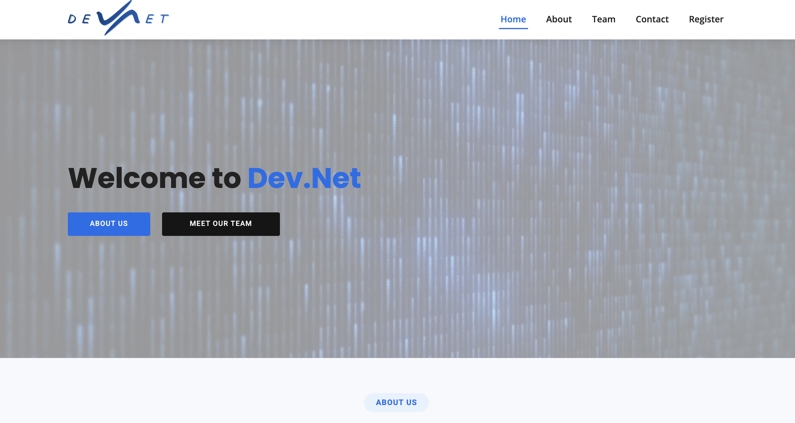

  

# 🌐 Developer Network Website (Dev.Net) — *Archived Project*

This is the official website that was built for **Dev.Net**, the **first-ever technology club launched at HighScope Indonesia**.  
The club was dedicated to fostering a love for **programming, design, video editing, and technology** among students.

⚠️ **Note:** The Dev.Net club is no longer operational, but this repository and website remain as a showcase of the project and my contribution to building a student tech community.

🔗 Live Website (archived): [hsdevnet.com](https://hsdevnet.com)

---

## 📖 About the Project
The Developer Network Website was created to serve as the central hub of the club.  
It was designed to:
- Provide students with tools, resources, and a supportive community.  
- Showcase the club’s **mission, vision, and team members**.  
- Represent Dev.Net publicly as the first student-led tech initiative in the school.  

This was also one of my earliest experiences in **web development, hosting, and leading a real community project**.

---

## ✨ Features
- 🏠 **Homepage** – Welcome section with call-to-action buttons.  
- 📖 **About Page** – Mission, values, and goals of the club.  
- 👥 **Team Page** – Introduced the founding and leadership team.  
- 📬 **Contact Page** – Address, email, phone, and integrated form.  
- 📝 **Register Page** – Allowed students to join the club.  
- 📱 **Responsive Design** – Accessible on desktop and mobile devices.  

---

## 🛠️ Tech Stack
- **HTML5 / CSS3 / JavaScript** – Frontend  
- **PHP** – Contact form backend  
- **Hostinger** – Hosting and domain management  

---

## 🚀 Deployment
The site was hosted on **Hostinger** with a custom domain: [hsdevnet.com](https://hsdevnet.com).  
Deployment involved uploading project files to Hostinger’s web server (via File Manager/FTP).  

---

## 👨‍💻 Team (at the time)
- **Joseph Davis Chamdani** – Founder  
- **Raja Michael Hegarty** – Co-Founder & Club Head  
- **Pramana Maxmarthin Pieroelie** – Secretary  
- **Muhammad Rizqi Iriawan** – External Head  
- … and other dedicated members  

---

## 📸 Project Preview
  

---

## 📜 Status
- ✅ **Completed**: The website successfully launched and represented Dev.Net during its active period.  
- ❌ **Archived**: Dev.Net is no longer active, but this repository remains as a record of the project.  

---

## 💡 Personal Note
Dev.Net was the **first tech club to ever be launched at HighScope Indonesia School**, and I’m proud to have been its **founder**.  
Even though the club is no longer active, it marked a milestone in my journey — combining **leadership, community-building, and web development** for the very first time.  
